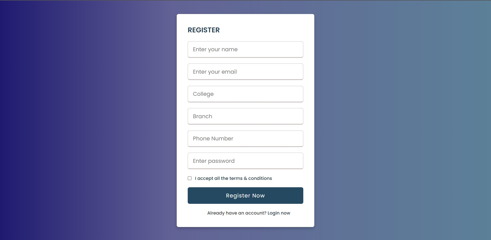
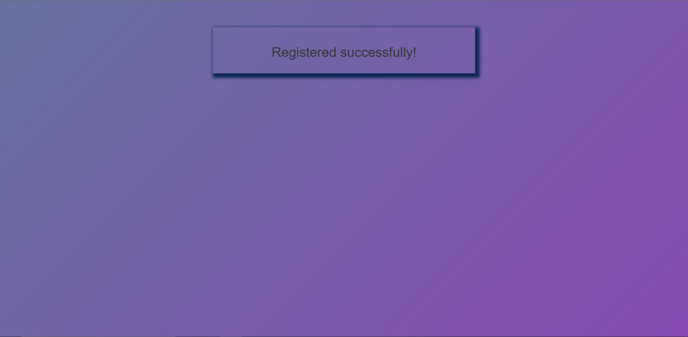
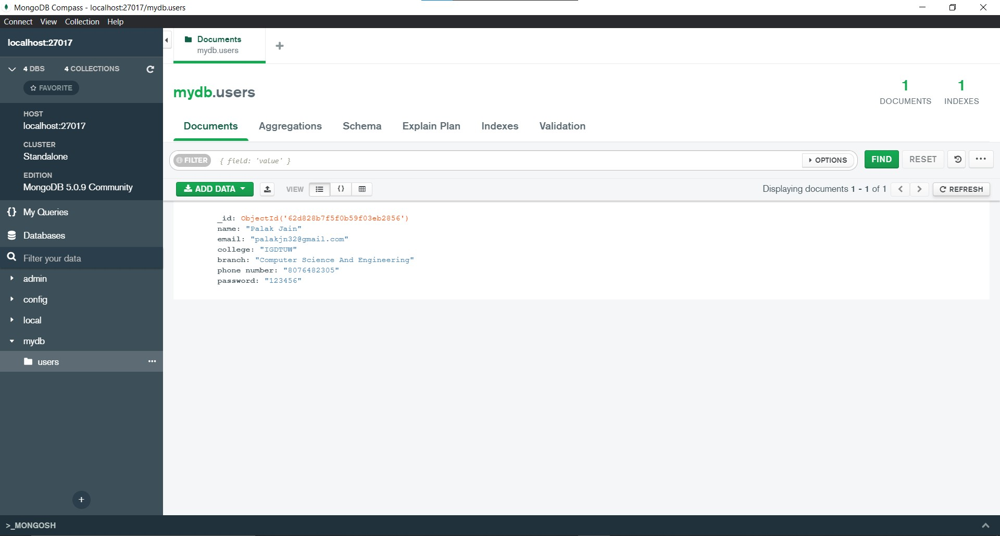

# Registration-Form

This is a registration form assigned as a task for **Innerve, the Technical Fest of IGDTUW**.

## Getting Started - Installation
- Clone or download this repository to your local machine.

```bash
git clone https://github.com/TechGeek3/Registration-Form.git
```

-Install and setup mongosh, nodejs, mongodbCompass and keep them running in the background.
- Install **express, mongoose, body-parser** and **nodemon** using the command below after changing the directory to `Registration-Form`.

```bash
npm install express mongoose body-parser nodemon
```

- In case there are any bugs or vulnerabilites, run the command `npm audit fix`.
- Now, run `nodemon` to check whether everything's working fine.
- In the browser, head over to `http://localhost/3000/`.
- To terminate the process run `CTRL + C` in the terminal.
<hr>

## Screenshots of the Form

<hr>

<hr>

<hr>
